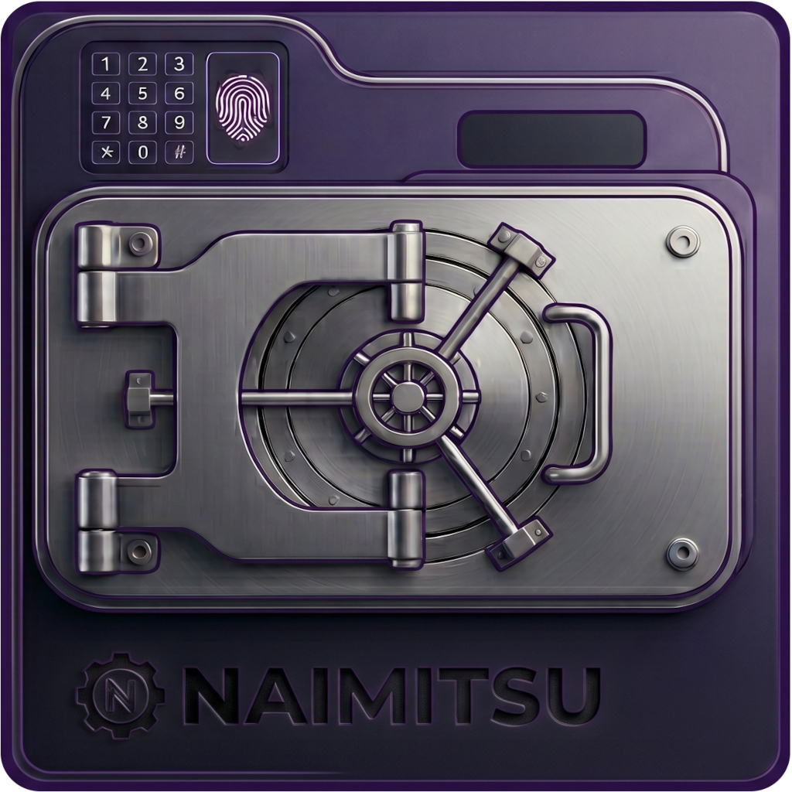
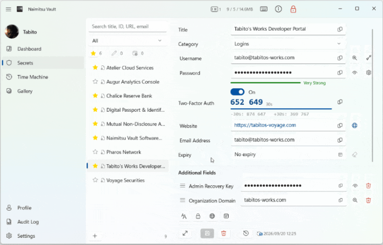

  

<h1 align="center">ないみつクン — Naimitsu Vault</h1>

  <a href="README.md">English</a> | <strong>日本語</strong>

  パスワードも、画像も、証明書も。機密のすべてを、ひとつの金庫に。 
  完全無料・ローカル完結型の Windows 用機密情報マネージャー（WinUI 3）

> **パスワードマネージャーという呪縛を解き、機密情報の守護者となるゴーレム**

---

  <strong>君の金庫には、「文字列」しか入らないのか？</strong>

---

- ID・免許証・パスポートの画像、証明書、ライセンス――「ファイルの機密」を、パスワードと同じ金庫に収めたいと思わないか？
- 煩わしい「保存しますか？」の確認から解放され、編集中のデータと現在のデータを横並びで差分比較したいと思わないか？
- 過去のパスワードに戻したら、肝心の最新データまで一緒に消えていた――そんな経験に嘆いたことはないか？
- 仕事の機密とプライベートの資産を、ひとつの金庫内で無理やりカテゴリ分けして同居させていないか？
- 決められた入力欄しか使えず、自由に項目を追加したりドラッグして並べ替えられない不満はないか？
- 1ヶ月前の自分がどのデータを触ったか、記憶ではなく「改ざん不能な記録」で証明できるか？

---

**そのすべての不自由を解き放つ「答え」が、ここにある。**

パスワードという文字列の枠を超え、ファイルも画像も自由に束ねる共有プール（複数の機密情報から参照可能）。
「保存しますか？」の煩わしさを根絶する 即時下書き＆差分比較。
そして、復元しても最新データを決して失わない 上書き事故ゼロの 3 世代タイムマシン。

インターネットに接続できない環境でも問題なく使える、完全オフライン設計。USB に入れて持ち歩くこともできる。アプリ自身がクラウドへデータを送出することは一切ない。

---

## 特徴

<video src="https://github.com/user-attachments/assets/b8bf31f7-e5d4-44cc-ba15-84b0422e5f5b" autoplay loop muted playsinline width="100%"></video>

- **ファイル暗号化保管・ビューワ** — 画像・PDF・証明書・SSH/GPG 鍵・設定ファイル・圧縮ファイルを AES-256-GCM で暗号化保存し、アプリ内で閲覧
- **画像ギャラリー（共有プール方式）** — 1つのファイルを複数の機密情報から参照。HMAC-SHA256 による重複排除
- **ダイアログフリー即時自動保存** — 編集内容を自動で下書き保存し、現在のデータと横並びで差分比較
- **タイムマシン（3世代ローテーション）** — どの世代を復元しても、上書きで最新データを失わない
- **保管庫分離＆緊急アクセスコード** — 完全に独立した最大3個の保管庫と、PIN 保護された QR コードによる閲覧専用の緊急アクセス
- **改ざん不可の監査ログ** — すべての操作を暗号化して自動記録（180日保持）
- **2段階認証（TOTP）・Windows Hello・キーボード自動入力・クリップボード保護・オートバックアップ・CSV/JSON エクスポート／インポート** ほか

全機能の一覧と制限事項は **[機能一覧](docs/features-ja.md)** を参照してください。

---

## 配布形態

用途に応じて最適な形態を選択できます。どちらの形態でも、データの暗号境界モデルおよびセッションセキュリティは同一です。

| 形態               | データベース（.nkdb）の保存場所                           | 用途・特徴                                       |
| ---------------- | -------------------------------------------- | ------------------------------------------- |
| **インストーラー版**     | `%LOCALAPPDATA%\TabitosWorks\NaimitsuVault\` | 自宅や職場の固定 PC で、通常のデスクトップアプリとして安定運用する標準形態。    |
| **ZIP 版（ポータブル）** | 実行ファイルと同じフォルダ内の `data\` サブフォルダ               | USB スティック等に丸ごと格納し、環境を汚さずにどこへでも安全に持ち出せる運用形態。 |

---

## インストール

**[Releases](https://github.com/tabitos-atelier/naimitsu-vault/releases) から最新版をダウンロード**

- `NaimitsuVault-Setup-x64.exe` — インストーラー版（推奨）
- `NaimitsuVault-x64.zip` — ZIP 版（ポータブル）

**動作要件**

- Windows 11 x64（Windows 10 環境は検証対象外です）

> ないみつクンは、完全ローカル環境での Windows ネイティブな動作を前提に設計されています。そのため、他 OS（macOS / Linux）やスマートフォン版（iOS / Android）への移植・開発の予定はありません。

初回起動時に Windows SmartScreen の保護画面が表示された場合や、ZIP 版をアップデートする場合は **[よくある質問（FAQ）](docs/faq-ja.md)** を参照してください。

---

## ドキュメント

| ドキュメント                                                          | 内容                                     |
| --------------------------------------------------------------- | -------------------------------------- |
| [機能一覧](docs/features-ja.md)                                     | 全機能の一覧・制限事項・データの保存形式                   |
| [よくある質問（FAQ）](docs/faq-ja.md)                                 | SmartScreen の警告、ZIP 版のアップデート方法ほか      |
| [エクスポート・インポート フォーマット仕様](docs/import-export-format-ja.md) | 他ツールからの移行に使う CSV/JSON のデータ形式          |
| [Languages - カスタムロケール](docs/locale-guide-ja.md)                | ロケールファイルによる言語の追加・UI 文言のカスタマイズ          |
| [SECURITY-ja.md](SECURITY-ja.md)                                | 暗号化仕様・想定する脅威の境界・脆弱性の報告手順               |

---

## セキュリティと暗号化

ないみつクンは、外部への送信機能を一切持たない完全ローカル完結型の金庫アプリです（※設定画面で「サイトアイコンの自動取得」を明示的に有効にした場合の、外向きファビコン要求を除く）。データ永続化からメモリ管理に至るまで、以下のセキュリティ設計が適用されています。

- **データ永続化と暗号化**: すべての機密データおよび添付ファイルは、**AES-256-GCM + Argon2id** で暗号化されます。SQLiteのTEXT型を排除し、不変文字列によるメモリ汚染を防ぐため**生のバイナリBLOB**として直接格納します。
- **鍵導出関数**: パスワードからの暗号鍵導出には、GPU/ASICによる大規模な総当たり攻撃に対して高い耐性を持つ **Argon2id** を採用しています。
- **クリップボード保護**: コピーされた機密テキストは、Windows標準の「クリップボード履歴（Win+V）」やデバイス間同期から除外されます。また、**30秒後にバックグラウンドタイマーにより確定的自動消去**されます。
- **ゼロディスク残留**: 暗号化されたPDFや画像をビューワで閲覧する際、ディスク上への平文一時ファイル（キャッシュ）の書き出しを一切行いません。復号データはメモリ上のみに展開され、閉鎖時に完全に抹消されます。

> ⚠️ **免責事項**
> 本ソフトウェアは個人プロジェクトであり、第三者専門機関による独立したセキュリティ監査は実施していません。合理的な設計を行っていますが、完全な安全性を保証するものではありません。損失が許容不能な**重要データの管理には使用しないでください。** 利用はすべて自己責任の原則に基づきます。

具体的な暗号化仕様、本アプリが想定する脅威の境界、および脆弱性の報告手順についての詳細は、セキュリティポリシー [SECURITY-ja.md](SECURITY-ja.md) をご一読ください。

---

## ⚠️バックアップと復元の重要な注意事項

- **Windows Hello（生体認証・PIN）は復元時に引き継がれません**
  Windows Hello の認証情報は、お使いの PC（Windows アカウント）固有の暗号化（DPAPI）で保護されています。別の PC へ移行する場合はもちろん、**同一 PC 上でバックアップから復元した場合でも**、安全のため Windows Hello の設定は自動的に無効化されます。復元後の初回ログインには、必ずマスターパスワードによる手動でのロック解除が必要です（Windows Hello はロック解除後、設定画面から再設定できます）。
- **マスターパスワードは必ず安全な場所に控えてください**
  ないみつクンは完全なゼロナレッジ設計（開発者を含め誰も代わりに復号できない、裏口なしの設計）です。マスターパスワードを忘れた場合、バックアップファイルが手元にあってもデータを復元することは原理的に不可能です。日常的に Windows Hello だけでロック解除している場合でも、マスターパスワードは安全な場所に保管してください。

---

## ライセンスと法的規定

本ソフトウェアは [MIT License](LICENSE) の下で公開されています。フォーク・改変・再配布・商用利用はすべて自由です（ただし、名称の使用方法には [LEGAL-ja.md](LEGAL-ja.md) に定めがあります）。

また、**YouTube、ブログ、SNS等のWebメディアでの紹介やレビューにあたって、著作者への事前連絡や許可は一切不要です。** 自由にご活用ください。

ないみつクンは、Tabito's Works が個人として独立して開発・公開しているプロジェクトです。著作者が現在所属する、または過去に所属していた企業・団体の業務として開発されたものではなく、それらの後援・推奨を受けたものでも、それらの見解を表すものでもありません。**所属組織を含むいかなる組織も、著作者の事前の書面許諾なく、本ソフトウェアやその開発を自組織の成果・実績として対外的に提示することを禁止します。**

免責事項の詳細、準拠法および合意管轄、メディア掲載に関する法的規定、名称・ロゴの取り扱い、無関係性の表明については、[LEGAL-ja.md](LEGAL-ja.md) をご確認ください。

---

## あとがき

ないみつクンは、私の・私による・私のためのアプリとして生まれました。

「パスワードマネージャーという枠組みを超え、ファイルも履歴も安全に束ねられる、真のローカル金庫が欲しい」――
機能過多なツールにため息をつき、同じ不自由を感じていた誰かの確かな拠り所になれば、それ以上の喜びはありません。

このゴーレムがどのような砂の中から掘り出され、どう調律されてきたのか――
作者の生い立ちや旅の軌跡は、プロフィール（旅人の横顔）の羊皮紙に記してあります。

📜 [たびとの旅路 — 旅人の横顔（プロフィール）](https://tabitos-voyage.com/about)

---

  <strong>Naimitsu keeps your database. Let's vault in!!!</strong>

  Tabito's Works — <a href="https://github.com/tabitos-atelier">@tabitos-atelier</a>

